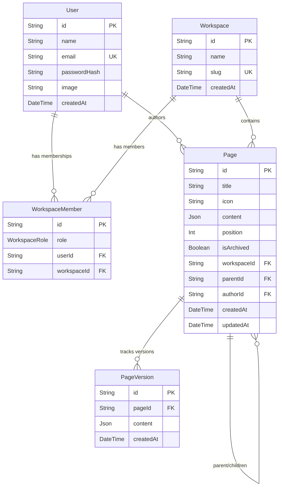
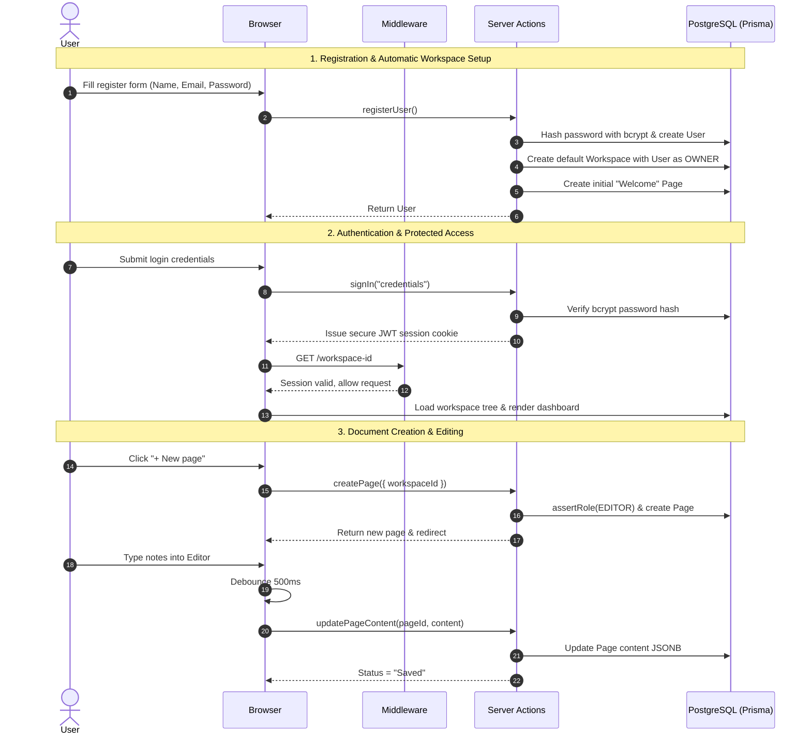

# NestDocs — Complete Project Documentation & Technical Specification

> **Project Name:** NestDocs (Personal Workspace)  
> **Repository:** `ishan79148/My-Personal-Workspace`  
> **Type:** Full-Stack Web Application  
> **Core Focus:** Notion-style nested document editor with multi-tenancy, recursive document hierarchies, role-based access control (RBAC), and debounced auto-saving.

---

## Table of Contents

1. [Project Overview](#1-project-overview)
2. [Core Value Propositions & Highlights](#2-core-value-propositions--highlights)
3. [Technology Stack](#3-technology-stack)
4. [High-Level Architecture](#4-high-level-architecture)
   - [System Architecture Diagram](#system-architecture-diagram)
   - [Runtime Boundary Strategy (Edge vs. Node)](#runtime-boundary-strategy-edge-vs-node)
   - [Adjacency List & Recursive Document Tree](#adjacency-list--recursive-document-tree)
5. [Database Architecture & Data Models](#5-database-architecture--data-models)
   - [Entity Relationship Diagram (ERD)](#entity-relationship-diagram-erd)
   - [Schema Specifications (Prisma)](#schema-specifications-prisma)
   - [Relational Integrity & Cascades](#relational-integrity--cascades)
6. [Role-Based Access Control (RBAC) System](#6-role-based-access-control-rbac-system)
   - [Role Hierarchy & Ranking](#role-hierarchy--ranking)
   - [Permission Matrix](#permission-matrix)
   - [Enforcement Mechanisms](#enforcement-mechanisms)
7. [System Workflows & User Journeys](#7-system-workflows--user-journeys)
   - [User Registration & Onboarding](#1-user-registration--onboarding)
   - [Authentication & Session Flow](#2-authentication--session-flow)
   - [Workspace Navigation & Switching](#3-workspace-navigation--switching)
   - [Document Tree Lifecycle](#4-document-tree-lifecycle-create-nest-move-archive)
   - [Real-Time Debounced Auto-Save Pipeline](#5-real-time-debounced-auto-save-pipeline)
   - [Team Member Invitation & Role Management](#6-team-member-invitation--role-management)
8. [Project File & Directory Structure](#8-project-file--directory-structure)
9. [Server Actions & API Reference](#9-server-actions--api-reference)
10. [Local Development & Setup Guide](#10-local-development--setup-guide)
11. [Extensibility & Production Roadmap](#11-extensibility--production-roadmap)

---

## 1. Project Overview

**NestDocs** is an enterprise-ready, Notion-inspired document workspace platform. It enables individuals and teams to organize complex knowledge bases using an infinitely nestable page hierarchy. Every user can create or join multiple isolated workspaces, invite collaborators with granular roles (Owner, Admin, Editor, Viewer), create documents with nested children, and author content with automated, background persistence.

The project is built on the modern Next.js App Router architecture, leveraging React Server Components (RSC) for zero-client-bundle data fetching, Server Actions for secure mutations, Auth.js for robust session management, and Prisma ORM on top of PostgreSQL for relational integrity and fast hierarchical queries.

---

## 2. Core Value Propositions & Highlights

- **Multi-Tenant Isolation:** Users can belong to multiple workspaces. Workspace data, members, and documents remain strictly isolated.
- **Infinite Document Nesting:** Rather than limiting notes to folders or single levels, pages can be parents to sub-pages, which in turn can host their own sub-pages to any depth.
- **Strict Role-Based Access Control (RBAC):** Every action (editing pages, inviting teammates, changing settings) is checked against a strict role ladder (`OWNER` > `ADMIN` > `EDITOR` > `VIEWER`).
- **Low-Latency Debounced Auto-Save:** Changes in the editor automatically sync to the server in the background using a customized debounced hook, showing instant feedback (`idle`, `saving`, `saved`, `error`) without full-page reloads.
- **Fast First Page Loads:** Server Components fetch document trees and pages directly from the database, streaming fully rendered HTML to the client with minimal JavaScript overhead.
- **Clean Relational Integrity:** Cascading deletes ensure that removing a workspace or page cleanly removes all associated sub-pages, versions, and memberships without orphan data.

---

## 3. Technology Stack

| Layer | Technology | Version | Purpose & Rationale |
|---|---|---|---|
| **Framework** | Next.js (App Router) | `^15.0.0` | React Server Components, Server Actions for mutations, parallel layouts, and fast SSR. |
| **Language** | TypeScript | `^5.5.0` | Strict type safety across database schemas, recursive trees, and role policies. |
| **Library** | React & React DOM | `^18.3.1` | Declarative UI rendering, hooks, and client-side interactivity. |
| **Database** | PostgreSQL | 15+ / Serverless (Neon/Supabase) | Relational model, foreign keys, cascading deletes, JSONB flexibility, and recursive CTE capabilities. |
| **ORM** | Prisma ORM | `^5.20.0` | Type-safe queries, automatic client generation, migrations, and database seeding. |
| **Authentication** | Auth.js (NextAuth.js v5 Beta) | `5.0.0-beta.25` | Session management with JWT strategy and credentials authentication. |
| **Password Security** | bcryptjs | `^2.4.3` | Cryptographic hashing for user password storage. |
| **Validation** | Zod | `^3.23.8` | Schema validation and input sanitation. |
| **Styling** | Tailwind CSS & PostCSS | `^3.4.10` | Utility-first, responsive, and minimalist typography/layout design. |

---

## 4. High-Level Architecture

### System Architecture Diagram

```mermaid
graph TD
    subgraph Client Browser
        UI[Next.js Client Components]
        Editor[Editor Component]
        AutoSaveHook[useAutoSave Hook]
        TreeUI[PageTree & WorkspaceSwitcher]
    end

    subgraph Edge Runtime
        MW[Next.js Middleware (src/middleware.ts)]
    end

    subgraph Node.js Server Environment
        Auth[Auth.js (Session & JWT Validation)]
        RSC[React Server Components (Layouts & Pages)]
        SA[Server Actions (Mutations & RBAC Checks)]
        Perm[Permissions Engine (assertRole / ROLE_RANK)]
        TreeBuilder[buildTree Tree Generator]
    end

    subgraph Database Layer
        Prisma[Prisma Client (lib/db.ts)]
        Postgres[(PostgreSQL Database)]
    end

    UI --> MW
    MW -->|Authorized Session| RSC
    UI -->|Invoke Mutations| SA
    Editor -->|Debounced 500ms| AutoSaveHook
    AutoSaveHook -->|updatePageContent| SA
    SA --> Perm
    Perm --> Prisma
    RSC --> Prisma
    Prisma --> Postgres
    TreeBuilder -->|Formats flat pages to recursive tree| RSC
    RSC --> TreeUI
```

### Runtime Boundary Strategy (Edge vs. Node)

Next.js Middleware runs inside the **Edge Runtime** (lightweight V8 isolates). Standard PostgreSQL drivers (`pg`) and standard Prisma client run on the **Node.js Runtime**.

To maintain maximum performance and compatibility, NestDocs implements a dual-boundary model:
1. **Edge Boundary (`src/middleware.ts`):** Performs a lightweight JWT existence check. If no session token is present, unauthenticated requests to protected paths are immediately redirected to `/login` with a `callbackUrl`.
2. **Node Boundary (`(dashboard)/[workspaceId]/layout.tsx` & Server Actions):** Deep database-backed workspace checks and role validations are performed in Server Components and Server Actions where Prisma has full Node access. If a user attempts to access a workspace they do not belong to, they are routed to `/no-access`.

### Adjacency List & Recursive Document Tree

Document hierarchies are modeled using an **Adjacency List** pattern (`parentId` self-relation on the `Page` model):
- A top-level page has `parentId = null`.
- A child page stores the `id` of its parent page in `parentId`.
- The database stores flat pages indexed by `[workspaceId, parentId]`.
- The helper `buildTree` (`src/lib/build-tree.ts`) transforms flat database rows into a recursive nested tree structure (`PageNode[]` with nested `children`) in $O(N)$ computational time.

---

## 5. Database Architecture & Data Models

### Entity Relationship Diagram (ERD)



### Schema Specifications (Prisma)

#### 1. `User`
Stores registered account credentials and profile details.
- `id` (`String`, CUID primary key)
- `name` (`String?`)
- `email` (`String`, unique)
- `passwordHash` (`String?`, bcrypt hash)
- `image` (`String?`)
- `createdAt` (`DateTime`, default `now()`)
- Relations: `memberships` (`WorkspaceMember[]`), `pagesCreated` (`Page[]`)

#### 2. `Workspace`
The root tenant entity. Every document belongs to exactly one workspace.
- `id` (`String`, CUID primary key)
- `name` (`String`)
- `slug` (`String`, unique, URL-safe slug)
- `createdAt` (`DateTime`, default `now()`)
- Relations: `members` (`WorkspaceMember[]`), `pages` (`Page[]`)

#### 3. `WorkspaceRole` (Enum)
```prisma
enum WorkspaceRole {
  OWNER
  ADMIN
  EDITOR
  VIEWER
}
```

#### 4. `WorkspaceMember`
Join model connecting `User` and `Workspace` with an assigned role.
- `id` (`String`, CUID primary key)
- `role` (`WorkspaceRole`, default `EDITOR`)
- `userId` (`String`, foreign key to `User`)
- `workspaceId` (`String`, foreign key to `Workspace`)
- Constraint: `@@unique([userId, workspaceId])` (a user can only have one membership per workspace)

#### 5. `Page`
The core document entity.
- `id` (`String`, CUID primary key)
- `title` (`String`, default `"Untitled"`)
- `icon` (`String?`, emoji or icon identifier)
- `content` (`Json?`, rich text or block content stored in JSON/JSONB format)
- `position` (`Int`, default `0`, ordering among siblings)
- `isArchived` (`Boolean`, default `false`, soft deletion/trash support)
- `workspaceId` (`String`, foreign key to `Workspace`)
- `parentId` (`String?`, self-referencing foreign key to parent `Page`)
- `authorId` (`String`, foreign key to `User`)
- `createdAt` & `updatedAt` (`DateTime`)
- Indexes: `@@index([workspaceId, parentId])` (optimizes sibling and workspace queries)
- Relations: `workspace`, `parent`, `children`, `author`, `versions`

#### 6. `PageVersion`
Historical snapshots of page contents for version control.
- `id` (`String`, CUID primary key)
- `pageId` (`String`, foreign key to `Page`)
- `content` (`Json`)
- `createdAt` (`DateTime`, default `now()`)

### Relational Integrity & Cascades
- **Cascade on Workspace Deletion:** Deleting a `Workspace` automatically deletes all its `WorkspaceMember` records and all contained `Page` records.
- **Cascade on Page Deletion:** Deleting a `Page` automatically deletes all child sub-pages (`onDelete: Cascade` on `parentId`) and all its historical `PageVersion` snapshots.
- **Cascade on User Deletion:** Deleting a `User` cascades down to remove their `WorkspaceMember` memberships.

---

## 6. Role-Based Access Control (RBAC) System

### Role Hierarchy & Ranking

Permissions are hierarchical and strictly ordered. Defined in [`src/lib/permissions.ts`](file:///c:/Users/Ishan/Documents/My_projects/My-personal-workspace/src/lib/permissions.ts):

```typescript
export const ROLE_RANK: Record<WorkspaceRole, number> = {
  VIEWER: 1,
  EDITOR: 2,
  ADMIN:  3,
  OWNER:  4,
};
```

Any operation requiring a given role automatically permits any role of equal or higher rank:
$$\text{hasRole}(\text{actual}, \text{required}) \iff \text{ROLE\_RANK}[\text{actual}] \ge \text{ROLE\_RANK}[\text{required}]$$

### Permission Matrix

| Operation / Capability | Minimum Required Role | Allowed Roles |
|---|---|---|
| View pages & read document content | `VIEWER` | Viewer, Editor, Admin, Owner |
| Create top-level or sub-pages | `EDITOR` | Editor, Admin, Owner |
| Edit page text / content | `EDITOR` | Editor, Admin, Owner |
| Rename pages | `EDITOR` | Editor, Admin, Owner |
| Move / reorder pages in tree | `EDITOR` | Editor, Admin, Owner |
| Archive / Restore pages | `EDITOR` | Editor, Admin, Owner |
| Invite new team members | `ADMIN` | Admin, Owner |
| Change existing member roles | `ADMIN` | Admin, Owner |
| Remove members from workspace | `ADMIN` | Admin, Owner |
| Rename workspace | `ADMIN` | Admin, Owner |
| Delete workspace / Transfer ownership | `OWNER` | Owner |

### Enforcement Mechanisms

Every mutation in `src/actions/` verifies:
1. **Authentication:** Checks whether `session.user.id` exists via `await auth()`. Throws `"UNAUTHENTICATED"` if missing.
2. **Authorization:** Calls `await assertRole(userId, workspaceId, requiredRole)`.
3. **Database query:** Retrieves `db.workspaceMember.findUnique({ where: { userId_workspaceId: { userId, workspaceId } } })`.
4. **Validation:** Checks if `ROLE_RANK[member.role] >= ROLE_RANK[required]`. Throws `"FORBIDDEN"` if insufficient.

---

## 7. System Workflows & User Journeys



### 1. User Registration & Onboarding
1. User visits `/register` and submits their name, email, and password.
2. `registerUser` checks for existing accounts, hashes the password via `bcrypt.hash(password, 10)`, and writes the `User` record.
3. It immediately provisions a personal workspace (e.g., `"Ishan's Workspace"`) with a randomized slug and assigns the user as `OWNER`.
4. A starter document (*"👋 Welcome to your Workspace"*) is automatically created.
5. If an existing user logs in with zero workspaces, the dashboard layout automatically redirects them to `/onboarding` to initialize one.

### 2. Authentication & Session Flow
- **Provider:** Credentials-based authentication using Auth.js (NextAuth v5 beta).
- **Session Strategy:** Stateless JSON Web Tokens (`jwt`).
- **Callbacks:** The `jwt` callback attaches the internal database user ID to the token, and the `session` callback populates `session.user.id`.
- **Route Protection:** Handled via `middleware.ts` matching all non-static, non-public routes.

### 3. Workspace Navigation & Switching
- `DashboardLayout` (`src/app/(dashboard)/layout.tsx`) queries all workspace memberships for the logged-in user.
- The sidebar displays `WorkspaceSwitcher` (dropdown) allowing seamless switching between organizations without re-authenticating.
- Selecting a different workspace navigates to `/{newWorkspaceId}`.

### 4. Document Tree Lifecycle (Create, Nest, Move, Archive)
- **Create Top-Level:** Triggered by "+ New page" on the sidebar; calls `createPage({ workspaceId })` with `parentId = null`.
- **Create Nested Child:** `createPage({ workspaceId, parentId: parentPageId })` nests the new document under the target parent.
- **Auto Position Calculation:** Calculates sibling count using `db.page.count` to position the new page at the end of the sibling array.
- **Move / Reorder:** `movePage({ pageId, newParentId, newPosition })` updates parent pointers and positions.
- **Archival / Trash:** `archivePage(pageId)` sets `isArchived = true`, removing the page and its children from the active tree. `restorePage(pageId)` restores it.

### 5. Real-Time Debounced Auto-Save Pipeline
To eliminate manual save buttons while avoiding excessive network requests:
1. The client types into the `Editor` component. Local component state updates instantly for lag-free typing.
2. The custom hook `useAutoSave(content, onSave, delayMs = 500)` watches state changes.
3. `useDebounce` delays the trigger until 500ms of user inactivity.
4. When fired, the hook transitions state to `"saving"`.
5. The Server Action `updatePageContent(pageId, { text: value })` validates `EDITOR` role permissions and writes to the `Page.content` JSON column.
6. The hook transitions state to `"saved"`. If an error occurs (e.g., lost connection or unauthorized), it updates to `"error"`.

### 6. Team Member Invitation & Role Management
- Found under `/{workspaceId}/settings/members`.
- Admins/Owners submit a teammate's email and desired role.
- `inviteMember` looks up the registered user and executes an `upsert` on `WorkspaceMember`.
- `changeMemberRole` enables changing permissions dynamically.
- `removeMember` deletes the membership, instantly revoking workspace access.

---

## 8. Project File & Directory Structure

```
My-personal-workspace/
├── .env                          # Local environment secrets (DATABASE_URL, AUTH_SECRET)
├── .env.example                  # Template configuration file
├── docs/
│   └── ARCHITECTURE.md           # Engineering architecture and system design notes
├── PROJECT_DOCUMENTATION.md      # Comprehensive master documentation (this document)
├── prisma/
│   ├── migrations/               # Version-controlled SQL database migrations
│   │   └── 20260905000000_init/  # Initial schema migration
│   ├── schema.prisma             # Primary Prisma data models and database definitions
│   └── seed.js                   # Development seed script (Demo user, workspace, nested pages)
├── public/                       # Static public assets
├── src/
│   ├── actions/                  # Next.js Server Actions (Database mutations & role checks)
│   │   ├── auth-actions.ts       # Registration & account creation
│   │   ├── member-actions.ts     # Workspace invitations, role upgrades, member removal
│   │   ├── page-actions.ts       # Page creation, updates, reordering, archiving
│   │   └── workspace-actions.ts  # Workspace creation & renaming
│   ├── app/                      # Next.js App Router (Routes & Layouts)
│   │   ├── (auth)/               # Unauthenticated auth route group
│   │   │   ├── layout.tsx        # Centered auth container
│   │   │   ├── login/page.tsx    # Sign-in form
│   │   │   └── register/page.tsx # Registration form
│   │   ├── (dashboard)/          # Authenticated dashboard route group
│   │   │   ├── layout.tsx        # Global dashboard shell (sidebar, workspace switcher, user nav)
│   │   │   └── [workspaceId]/    # Dynamic workspace context
│   │   │       ├── layout.tsx    # Workspace membership gatekeeper (asserts user belongs to workspace)
│   │   │       ├── page.tsx      # Workspace overview & root document tree
│   │   │       ├── [noteId]/     # Note editor page
│   │   │       │   └── page.tsx  # Document view & Editor mounting
│   │   │       └── settings/     # Workspace administrative settings
│   │   │           ├── page.tsx  # General settings placeholder
│   │   │           └── members/  # Member management & team invitation page
│   │   │               └── page.tsx
│   │   ├── (marketing)/          # Public landing page
│   │   │   └── page.tsx          # Landing hero with conditional redirect for signed-in users
│   │   ├── api/auth/[...nextauth]/# NextAuth API route handlers
│   │   ├── no-access/page.tsx    # 403 Forbidden access-denied view
│   │   ├── onboarding/page.tsx   # First-time workspace creation wizard
│   │   ├── globals.css           # Tailwind base styles
│   │   ├── layout.tsx            # Root HTML layout with Inter font
│   │   └── providers.tsx         # Client-side context providers (SessionProvider)
│   ├── components/               # React UI Components
│   │   ├── editor/
│   │   │   └── Editor.tsx        # Auto-saving document editor
│   │   └── sidebar/
│   │       ├── PageTree.tsx      # Recursive document tree wrapper
│   │       ├── PageTreeItem.tsx  # Individual tree node with expandable children & navigation
│   │       ├── UserNav.tsx       # User profile display & sign-out button
│   │       └── WorkspaceSwitcher.tsx # Workspace selection dropdown
│   ├── hooks/                    # Reusable React hooks
│   │   ├── use-auto-save.ts      # Debounced auto-save hook with status tracking
│   │   └── use-debounce.ts       # Generic debouncer hook
│   ├── lib/                      # Core utility libraries
│   │   ├── auth.ts               # Auth.js configuration & credential provider
│   │   ├── build-tree.ts         # In-memory transformation from flat pages to tree
│   │   ├── db.ts                 # Global singleton Prisma client
│   │   └── permissions.ts        # Role rankings and permission assertion helpers
│   ├── types/                    # Shared TypeScript interfaces
│   │   ├── page.ts               # FlatPage, PageNode (recursive type)
│   │   ├── roles.ts              # WorkspaceRole re-export
│   │   └── workspace.ts          # WorkspaceSummary
│   └── middleware.ts             # Edge runtime session verification
├── next.config.js                # Next.js compilation settings
├── package.json                  # Dependencies, scripts, and package metadata
├── postcss.config.js             # PostCSS Tailwind plugin config
├── tailwind.config.ts            # Tailwind CSS design system configuration
└── tsconfig.json                 # TypeScript strict compiler configuration
```

---

## 9. Server Actions & API Reference

All database modifications are executed via Next.js **Server Actions** (`"use server"`), ensuring zero API boilerplate, automatic CSRF protection, and native integration with `revalidatePath`.

### Workspace Actions (`src/actions/workspace-actions.ts`)

| Action | Parameters | Role Required | Description |
|---|---|---|---|
| `createWorkspace` | `name: string` | Authenticated User | Creates a new workspace, auto-generates a slug, and assigns the caller as `OWNER`. |
| `renameWorkspace` | `workspaceId: string, name: string` | `ADMIN` | Renames an existing workspace. |

### Page Actions (`src/actions/page-actions.ts`)

| Action | Parameters | Role Required | Description |
|---|---|---|---|
| `createPage` | `{ workspaceId, parentId?, title? }` | `EDITOR` | Appends a new page to the workspace or nests it under `parentId`. |
| `updatePageContent` | `pageId: string, content: unknown` | `EDITOR` | Updates the JSON content payload of the page. |
| `renamePage` | `pageId: string, title: string` | `EDITOR` | Modifies the document title. |
| `movePage` | `{ pageId, newParentId, newPosition }` | `EDITOR` | Moves a page under a new parent and updates sibling sort position. |
| `archivePage` | `pageId: string` | `EDITOR` | Soft-deletes a page by marking `isArchived = true`. |
| `restorePage` | `pageId: string` | `EDITOR` | Un-archives a previously soft-deleted page (`isArchived = false`). |

### Member Actions (`src/actions/member-actions.ts`)

| Action | Parameters | Role Required | Description |
|---|---|---|---|
| `inviteMember` | `workspaceId, email, role?` | `ADMIN` | Upserts a membership for an existing registered user into the workspace. |
| `changeMemberRole` | `workspaceId, memberId, role` | `ADMIN` | Updates the access role of an existing member. |
| `removeMember` | `workspaceId, memberId` | `ADMIN` | Removes a member's access from the workspace. |

### Auth Actions (`src/actions/auth-actions.ts`)

| Action | Parameters | Access | Description |
|---|---|---|---|
| `registerUser` | `{ name, email, password }` | Public | Validates uniqueness, hashes password, creates user, provisions first workspace, and seeds initial note. |

---

## 10. Local Development & Setup Guide

### Prerequisites
- **Node.js:** v18.18+ or v20+
- **npm:** v9+
- **PostgreSQL Database:** A running local Postgres instance or a free cloud database (such as [Neon](https://neon.tech) or [Supabase](https://supabase.com)).

### Step-by-Step Setup

#### 1. Clone & Install Dependencies
```bash
npm install
```

#### 2. Configure Environment Variables
Create a `.env` file in the project root based on `.env.example`:
```env
DATABASE_URL="postgresql://<username>:<password>@<host>:5432/<database>?sslmode=require"
AUTH_SECRET="your-generated-auth-secret-here"
```

> **Tip:** Generate a secure `AUTH_SECRET` by running:
> ```bash
> openssl rand -base64 32
> ```

#### 3. Run Database Migrations
Initialize your database tables from `prisma/schema.prisma`:
```bash
npm run migrate
```
*(Or use `npm run db:push` if prototyping against an empty schema).*

#### 4. Seed the Database (Optional but Recommended)
Populate the database with a pre-configured user, workspace, and a nested document hierarchy:
```bash
npm run db:seed
```

**Default Seed Credentials:**
- **Email:** `demo@nestdocs.io`
- **Password:** `password123`

#### 5. Start the Development Server
```bash
npm run dev
```
Open [http://localhost:3000](http://localhost:3000) in your browser.

### Key NPM Scripts

| Command | Action |
|---|---|
| `npm run dev` | Starts the Next.js local development server on port 3000. |
| `npm run build` | Compiles and builds the production bundle. |
| `npm run start` | Boots the compiled production server. |
| `npm run migrate` | Executes Prisma migrations (`prisma migrate dev`). |
| `npm run migrate:deploy` | Applies pending migrations in production or CI environments. |
| `npm run studio` | Launches Prisma Studio GUI at `http://localhost:5555` to view and edit database rows. |
| `npm run db:seed` | Runs the database seeder script located in `prisma/seed.js`. |

---

## 11. Extensibility & Production Roadmap

The codebase has been designed with a modular architecture to facilitate immediate extensions:

1. **Rich Block-Based Editor Integration:**
   - The current `Editor.tsx` uses a simple `<textarea>` placeholder for demonstration.
   - It is designed to be directly swapped for **Tiptap** or **BlockNote** (built on ProseMirror).
   - Because `Page.content` is a PostgreSQL `JSON` column and `useAutoSave` accepts generic types, upgrading to full block-based rich text requires zero schema changes.

2. **Drag & Drop Sidebar Reordering:**
   - The backend mutation `movePage({ pageId, newParentId, newPosition })` is fully implemented in `src/actions/page-actions.ts`.
   - Wiring [`@dnd-kit/core`](https://dndkit.com/) into `PageTree.tsx` and `PageTreeItem.tsx` enables interactive drag-and-drop reordering.

3. **Trash & Restore UI:**
   - `archivePage` and `restorePage` actions exist. A dedicated `/{workspaceId}/trash` page can display soft-deleted documents with a one-click restore button.

4. **Token-Based Magic Link Invitations:**
   - Currently, `inviteMember` expects the target user to already exist in the database.
   - An invitation table (`WorkspaceInvite`) can be added to send email tokens via Resend/SendGrid, allowing non-registered teammates to sign up and auto-join.

5. **Full-Text Search:**
   - PostgreSQL GIN indexes or services like Algolia/Typesense can be attached to index `Page.title` and `Page.content` for a `Cmd + K` search dialog.

6. **Real-Time Multi-User Collaboration:**
   - Integration with Yjs or Liveblocks can be added to the rich-text editor for multiplayer cursor tracking and CRDT-based conflict resolution.

---

*Document compiled and maintained for **NestDocs (My-Personal-Workspace)**.*
